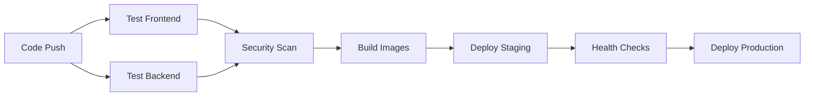

# 🚀 Deployment Guide

## Overview

This guide covers deploying the AI-Powered Business System to various environments using the built-in CI/CD pipeline.

## 📋 Prerequisites

### Required Secrets

Configure these secrets in your GitHub repository settings:

#### Supabase Configuration
- `NEXT_PUBLIC_SUPABASE_URL` - Your Supabase project URL
- `NEXT_PUBLIC_SUPABASE_ANON_KEY` - Supabase anonymous key (public)
- `SUPABASE_URL` - Your Supabase project URL (backend)
- `SUPABASE_ANON_KEY` - Supabase anonymous key (backend)
- `SUPABASE_SERVICE_ROLE_KEY` - Supabase service role key (backend)

#### AI Services
- `OPENAI_API_KEY` - OpenAI API key for GPT and DALL-E

#### Optional Services
- `N8N_WEBHOOK_URL` - n8n webhook URL for automation
- `N8N_API_KEY` - n8n API key
- `SLACK_WEBHOOK_URL` - Slack webhook for deployment notifications

## 🔄 CI/CD Pipeline

### Automatic Triggers

1. **Pull Request**: Runs tests and security scans
2. **Push to main**: Full CI/CD with deployment to staging
3. **Release**: Deploys to production
4. **Manual**: Can trigger deployment to any environment

### Pipeline Stages



## 🌍 Deployment Environments

### 1. Development (Local)

```bash
# Clone repository
git clone https://github.com/fuwiak/MVP_social_app.git
cd MVP_social_app

# Start development environment
make dev

# Access services
# Frontend: http://localhost:3001
# Backend: http://localhost:8000
```

### 2. Staging (Automatic)

Triggered automatically on push to `main` branch:

- Builds Docker images
- Pushes to GitHub Container Registry
- Deploys to staging environment
- Runs health checks

### 3. Production (Manual/Release)

#### Option A: GitHub Release
1. Create a new release on GitHub
2. CI/CD automatically deploys to production

#### Option B: Manual Deployment
1. Go to Actions → Deploy to Production
2. Select environment: `production`
3. Click "Run workflow"

## 🐳 Docker Deployment

### Using GitHub Container Registry

```bash
# Pull latest images
docker pull ghcr.io/fuwiak/mvp_social_app/frontend:latest
docker pull ghcr.io/fuwiak/mvp_social_app/backend:latest

# Run with docker-compose
docker-compose up -d
```

### Custom Docker Registry

```bash
# Build images
make build

# Tag for your registry
docker tag ai-business-frontend:latest your-registry.com/ai-business-frontend:latest
docker tag ai-business-backend:latest your-registry.com/ai-business-backend:latest

# Push to registry
docker push your-registry.com/ai-business-frontend:latest
docker push your-registry.com/ai-business-backend:latest
```

## ☁️ Cloud Deployment Options

### 1. DigitalOcean App Platform

```yaml
# .do/app.yaml
name: ai-business-system
services:
- name: frontend
  source_dir: /
  dockerfile_path: Dockerfile.frontend
  instance_count: 1
  instance_size_slug: basic-xxs
  envs:
  - key: NEXT_PUBLIC_SUPABASE_URL
    value: ${NEXT_PUBLIC_SUPABASE_URL}
  - key: NEXT_PUBLIC_SUPABASE_ANON_KEY
    value: ${NEXT_PUBLIC_SUPABASE_ANON_KEY}

- name: backend
  source_dir: /backend
  dockerfile_path: Dockerfile
  instance_count: 1
  instance_size_slug: basic-xxs
  envs:
  - key: SUPABASE_URL
    value: ${SUPABASE_URL}
  - key: OPENAI_API_KEY
    value: ${OPENAI_API_KEY}
```

### 2. Railway

```bash
# Install Railway CLI
npm install -g @railway/cli

# Login and deploy
railway login
railway init
railway up
```

### 3. Vercel + Railway

**Frontend (Vercel):**
```bash
# Install Vercel CLI
npm install -g vercel

# Deploy frontend
vercel --prod
```

**Backend (Railway):**
Deploy backend separately on Railway or any container platform.

### 4. AWS ECS/Fargate

```bash
# Build and push to ECR
aws ecr get-login-password --region us-east-1 | docker login --username AWS --password-stdin 123456789.dkr.ecr.us-east-1.amazonaws.com

docker build -t ai-business-frontend .
docker tag ai-business-frontend:latest 123456789.dkr.ecr.us-east-1.amazonaws.com/ai-business-frontend:latest
docker push 123456789.dkr.ecr.us-east-1.amazonaws.com/ai-business-frontend:latest
```

## 🔧 Environment Configuration

### Production Environment Variables

Create `.env.production`:

```bash
# Supabase
NEXT_PUBLIC_SUPABASE_URL=https://your-project.supabase.co
NEXT_PUBLIC_SUPABASE_ANON_KEY=your-anon-key
SUPABASE_URL=https://your-project.supabase.co
SUPABASE_ANON_KEY=your-anon-key
SUPABASE_SERVICE_ROLE_KEY=your-service-role-key

# AI Services
OPENAI_API_KEY=your-openai-key

# Optional
N8N_WEBHOOK_URL=https://your-n8n.com/webhook/business-system
N8N_API_KEY=your-n8n-key
REDIS_URL=redis://your-redis:6379

# Security
JWT_SECRET_KEY=your-super-secret-jwt-key
ALGORITHM=HS256
ACCESS_TOKEN_EXPIRE_MINUTES=30
```

## 📊 Monitoring & Health Checks

### Health Endpoints

- **Frontend**: `https://yourdomain.com/api/health`
- **Backend**: `https://api.yourdomain.com/health`

### Monitoring Setup

```bash
# Health check script
#!/bin/bash
curl -f https://yourdomain.com/api/health || exit 1
curl -f https://api.yourdomain.com/health || exit 1
echo "All services healthy"
```

## 🔒 Security Considerations

### Production Checklist

- [ ] All secrets configured in environment variables
- [ ] HTTPS enabled with valid SSL certificates
- [ ] Database connection strings secured
- [ ] API keys rotated regularly
- [ ] Container images scanned for vulnerabilities
- [ ] Rate limiting configured
- [ ] Monitoring and logging set up

### Security Headers

The application includes security headers:
- X-Content-Type-Options: nosniff
- X-Frame-Options: deny  
- X-XSS-Protection: 1; mode=block

## 🚨 Troubleshooting

### Common Issues

**1. Docker Build Fails**
```bash
# Clear Docker cache
make clean
docker system prune -f

# Rebuild
make build
```

**2. Database Connection Issues**
```bash
# Check Supabase credentials
curl "https://your-project.supabase.co/rest/v1/" \
-H "apikey: your-anon-key"
```

**3. API Rate Limits**
```bash
# Check OpenAI usage
curl https://api.openai.com/v1/usage \
-H "Authorization: Bearer your-api-key"
```

### Rollback Procedure

```bash
# Rollback to previous version
docker-compose down
docker pull ghcr.io/fuwiak/mvp_social_app/frontend:previous-tag
docker pull ghcr.io/fuwiak/mvp_social_app/backend:previous-tag
docker-compose up -d
```

## 📞 Support

For deployment issues:
1. Check GitHub Actions logs
2. Review container logs: `make logs`
3. Verify environment variables
4. Check health endpoints

## 🚀 Scaling

### Horizontal Scaling

```yaml
# docker-compose.prod.yml
version: '3.8'
services:
  frontend:
    deploy:
      replicas: 3
      
  backend:
    deploy:
      replicas: 2
```

### Load Balancing

Consider adding nginx or a cloud load balancer for production deployments with multiple replicas.
